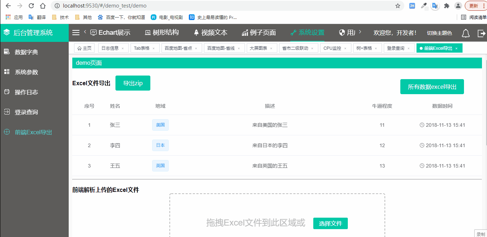

# 后台管理系统

> 写在前面：
git账号、项目反反复复重命名，github上的项目增增删删减减，老项目唯独留下该项目，也是通过实现这几个页面demo，学习了vue，算是一个纪念
   

# 使用的技术

1、Vue 2.5.10  
2、ES6          
3、Sass       
4、element-ui 2.3.4      
5、Axios       
6、Echart     
7、其他辅助技术包括Webpack、Gulp、Node等

## 浏览器兼容性     

兼容全球使用率大于1%的浏览器     
兼容每个浏览器的最近两个版本     
不兼容ie8及以下,不完全兼容ie9，兼容ie11及以上     
Edge16及以上    
火狐Firefox52及以上    
兼容谷歌Chrome     

## 安装运行打包

1、npm install         
2、npm run dev           
3、npm run build

## 在线mock
https://r46w.w.eolinker.com/share/index?shareCode=gwRWGX

## 系统截图

##### 首页
  

##### 大屏图表
 

##### 树+表格
 

##### 树的右键弹窗
 

##### 前端日志匹配
 

##### 自定义封装组件，ip输入框
 

##### 下拉框联动
 

##### 测试websocket
 

##### 前端下载Excel
 

Copyright (c) 2018-present Zheng
